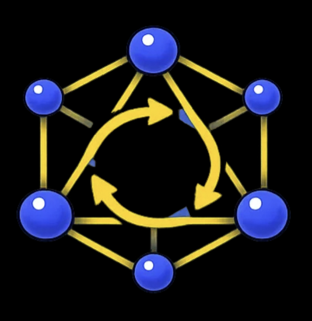

# Lattice

<p align="center">
  
</p>


Composable AI skills that teach assistants structured thinking -- design-first, context-aware, and architecture-guided.

## What is Lattice?

AI coding assistants jump straight to code, silently make design decisions, forget constraints mid-conversation, and produce output nobody reviewed against real engineering standards. Lattice fixes this with composable skills in [three tiers](#the-three-tiers) -- atoms, molecules, refiners -- that embed battle-tested engineering disciplines (Clean Architecture, DDD, design-first methodology, secure coding, and more), plus a [living context layer](docs/how-it-works.md#the-two-layers) (the `.ai/` folder) that accumulates your project's standards, decisions, and review insights. The system gets smarter with use -- after a few feature cycles, atoms aren't applying generic rules, they're applying *your* rules, informed by *your* history.

## The Three Tiers

Lattice organizes skills into three tiers. See [how-it-works](docs/how-it-works.md#how-atoms-molecules-and-refiners-differ) for detailed comparison.

|               | Purpose                              | Standalone? | Composes others? | Produces artifacts?         |
|---------------|--------------------------------------|-------------|------------------|-----------------------------|
| **Atoms**     | Single-principle guardrails          | Yes         | No               | No (inline checks)          |
| **Molecules** | Multi-step workflows                 | Yes         | Yes (atoms)      | Yes (blueprints, reviews)   |
| **Refiners**  | Optional config customization        | Yes         | No               | Yes (`.ai/` config files)   |

## Skill Inventory

### Atoms (9)

| Skill | What it does |
|-------|-------------|
| **clean-code** | Enforces function focus, naming clarity, complexity management, error handling, and self-documenting style |
| **architecture** | Validates layer responsibilities, dependency direction, and structural rules. Defaults to clean architecture; supports any style via the architecture-refiner |
| **domain-driven-design** | Enforces aggregate design, value objects over primitives, entity identity rules, bounded context boundaries |
| **secure-coding** | Applies trust boundary awareness, input validation, injection prevention, secrets management |
| **test-quality** | Enforces AAA structure, one behavior per test, assertion quality, test isolation, meaningful naming |
| **knowledge-priming** | Loads project-specific context (tech stack, architecture, conventions) so all skills operate with awareness of the real project |
| **design-first** | Guides structured design through 5 progressive levels (Capabilities, Components, Interactions, Contracts, Implementation) |
| **context-anchoring** | Manages per-feature living documents that capture decisions and reasoning across sessions |
| **collaborative-judgment** | Surfaces genuine judgment calls with structured options instead of silently assuming. See [design rationale](docs/collaborative-judgment.md) |

### Molecules (6)

| Skill | What it does | Atoms composed |
|-------|-------------|----------------|
| **lattice-init** | Guided setup -- scans the project, detects existing config, suggests refiners in priority order, creates `.ai/config.yaml` | knowledge-priming |
| **design-blueprint** | Runs a complete design workflow -- from context through progressive design levels to an approved blueprint | knowledge-priming, context-anchoring, collaborative-judgment, design-first, architecture, domain-driven-design |
| **code-forge** | Generates implementation from an approved blueprint or verbal requirements using inside-out layer ordering | knowledge-priming, context-anchoring, collaborative-judgment, architecture, clean-code, domain-driven-design, secure-coding, test-quality |
| **refactor-safely** | Restructures existing code without changing externally observable behavior. Requires agreement on the target structure before code changes and uses characterization tests as the safety net | knowledge-priming, context-anchoring, collaborative-judgment, clean-code, test-quality (always), design-first, architecture, domain-driven-design, secure-coding (conditional) |
| **bug-fix** | Investigates, reproduces, and safely fixes a bug with regression protection. Requires a failing reproduction before applying the repair | knowledge-priming, context-anchoring, collaborative-judgment, clean-code, test-quality (always), architecture, domain-driven-design, secure-coding (conditional) |
| **review** | Performs a structured, delta-scoped code review with severity-ordered findings. Supports optional process config via review-refiner | knowledge-priming (always), collaborative-judgment (always), clean-code (always), architecture, domain-driven-design, secure-coding, test-quality (conditional) |

### Refiners (5)

| Skill | What it produces |
|-------|-----------------|
| **architecture-refiner** | `.ai/standards/architecture.md` -- project-specific architecture principles. Supports clean architecture (default), hexagonal, modular monolith, or custom styles |
| **ddd-refiner** | `.ai/standards/ddd-principles.md` -- project-specific DDD guardrails for the domain-driven-design atom |
| **clean-code-refiner** | `.ai/standards/clean-code.md` -- project-specific coding standards for the clean-code atom |
| **knowledge-priming-refiner** | `.ai/standards/knowledge-base.md` -- project identity, tech stack, directory layout, and trusted sources |
| **review-refiner** | `.ai/standards/review-standards.md` -- project-specific review process configuration for the review molecule |

## The Pipeline

Skills form a delivery lifecycle: **lattice-init** → **design-blueprint** → **code-forge** → **review**, with **refactor-safely** covering behavior-preserving structural change and **bug-fix** covering defect-driven work that starts from a failing behavior. Each stage consumes and produces artifacts in `.ai/`, growing the living context layer. See [how-it-works](docs/how-it-works.md#the-design-to-code-pipeline) for the detailed flow.

## Getting Started

1. **Install skills into your project**: Lattice will be available as a proper plugin. For local testing after cloning the repo, use the install script to copy skills directly into your AI tool's skills directory:
   ```bash
   git clone <lattice-repo-url>
   cd lattice
   ./tools/install.sh /absolute/path/to/your/skills/folder
   ```
   Pass the skills directory of whichever AI tool you are using — the script is tool-agnostic:
   - **Claude Code**: `~/.claude/skills/` (global) or `/path/to/project/.claude/skills/` (project-local)
   - **Cursor**: `/path/to/project/.cursor/skills/`
   - **Any other tool**: the absolute path to that tool's skills folder

   All 20 skills are copied flat into that directory so your tool can discover them.

2. **Run `/lattice-init`** (recommended): Guided setup experience -- scans your project, suggests which refiners to run, and creates the `.ai/config.yaml`. This is the fastest path from install to first value.

3. **Or customize manually** (optional): Atoms ship with opinionated defaults that work immediately. If you prefer to set up manually instead of using `/lattice-init`, you have two paths:
   - **Run a refiner** -- a guided interview that produces the config file for you:
     ```
     /architecture-refiner       # Tailor layer structure and dependency rules
     /ddd-refiner                # Tailor domain modeling guardrails
     /clean-code-refiner         # Tailor coding standards and thresholds
     /knowledge-priming-refiner  # Capture project identity and tech stack
     /review-refiner             # Customize the review process (atom loading, severity, report format)
     ```
   - **Edit directly** -- create or modify standards documents in `.ai/standards/` by hand (see [how-it-works](docs/how-it-works.md#config-resolution) for the format).

   Refiners support enhancing specific sections (overlay mode), adding new sections, or replacing defaults entirely (override mode). Re-run a refiner or edit the config file whenever your standards evolve.

4. **Design a feature**: Invoke `/design-blueprint` to walk through progressive design levels before writing code.

5. **Implement**: Invoke `/code-forge` to generate implementation from the approved blueprint.

6. **Refactor safely**: Invoke `/refactor-safely` when improving structure without changing behavior. It agrees the target structure first, then uses characterization tests to protect the refactor.

7. **Fix regressions**: Invoke `/bug-fix` when starting from a failure. It establishes a failing reproduction first, then applies the smallest safe repair.

8. **Review**: Invoke `/review` to audit code changes against the relevant quality atoms.

### The `.ai/` folder

The `.ai/` folder is Lattice's living context layer -- the second half of the architecture. It stores all project-specific artifacts that grow with every feature cycle:

```
.ai/
├── config.yaml      # Central config (only file at root)
├── standards/       # Refiner-produced customization docs
│   └── review-standards.md  # (optional) Review process config
├── context/         # Per-feature living documents
├── learnings/       # Accumulated review insights (fed back into code-forge, refactor-safely, and bug-fix)
└── reviews/         # Review log for project health visibility
```

All persistent outputs go into subfolders — never `.ai/` root except `config.yaml`. See [docs/how-it-works.md](docs/how-it-works.md#the-ai-folder) for lifecycle details.

## Learn More

- [How It Works](docs/how-it-works.md) -- how atoms compose, config resolution, the pipeline, and tier comparison
- [Configuration Reference](docs/configuration.md) -- every `.ai/config.yaml` field documented: valid keys, produced by, consumed by, and merge modes
- [Framework Intelligence](docs/framework-intelligence.md) -- why things are designed this way: verification passes, feedback loops, AI compliance techniques
- [Collaborative Judgment](docs/collaborative-judgment.md) -- why AI should ask on genuine judgment calls and how this works at runtime

## License

MIT
