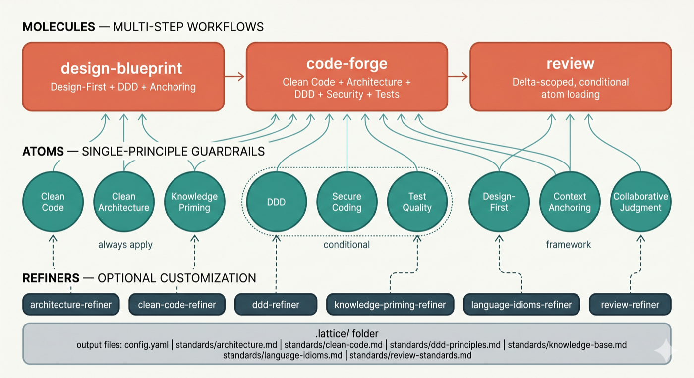
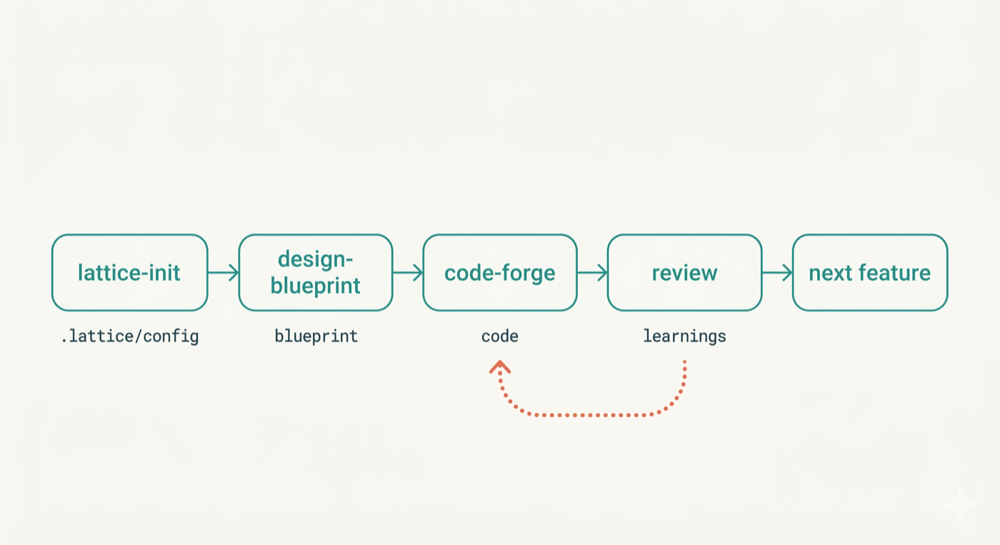

# Lattice

<p align="center">
  
</p>

Composable AI skills that teach assistants structured thinking — design-first, context-aware, and architecture-guided.

[](LICENSE)
[](https://claude.ai/marketplace)
[](https://cursor.com)
[](https://github.com/techygarg/lattice/blob/main/CONTRIBUTING.md)
[](https://martinfowler.com/articles/reduce-friction-ai/)

## What is Lattice?

AI coding assistants jump straight to code, silently make design decisions, forget constraints mid-conversation, and produce output nobody reviewed against real standards. Lattice fixes this with composable skills in three tiers — atoms, molecules, refiners — that embed battle-tested engineering disciplines plus a living context layer that accumulates your project's standards, decisions, and review insights across every feature cycle.

Three principles guided Lattice's design:

- **Skills over prompts** — versioned, team-owned skill files in the repository beat personal prompts on one developer's machine
- **Composability over monoliths** — small single-purpose skills that combine into workflows beat one instruction document that tries to cover everything
- **Living context over static config** — the `.lattice/` folder grows smarter with every feature cycle rather than being configured once and forgotten

## The Three Tiers

| Tier | Purpose |
|------|---------|
| **Atoms** | Single-principle guardrails — clean code, architecture, DDD, secure coding, test quality, design-first, and more |
| **Molecules** | Multi-step workflows that compose atoms — design, implement, refactor, fix, review |
| **Refiners** | Guided interviews that produce project-specific standards, customizing how atoms behave for your team |



See [How It Works](docs/how-it-works.md) for the full skill inventory and mechanics.

## The Pipeline

Skills form a delivery lifecycle: `requirement-forge` → `design-blueprint` → `code-forge` → `review`, with `refactor-safely` and `bug-fix` covering structural and defect-driven work. `requirement-forge` starts the pipeline — it acts as a senior PM + BA pair to produce structured feature specs in `.lattice/requirements/` that feed directly into `design-blueprint`. For teams with existing codebases, `architecture-compass` sits before the pipeline — it scans the repository, runs a structured interview, and produces an agreed architectural direction that orients the team before any code changes begin. Each stage consumes and produces artifacts in `.lattice/`, growing the living context layer.



## Getting Started

1. **Install Lattice** — choose the path that fits your setup:

   **Option A — Claude Code plugin (also works in Cursor — reads Claude Code skills automatically)**
   ```
   /plugins marketplace add techygarg/lattice
   /plugins install lattice
   /reload-plugins
   ```

   **Option B — Clone and install locally (any AI tool)**
   ```bash
   git clone https://github.com/techygarg/lattice.git
   cd lattice
   ./tools/install.sh /absolute/path/to/your/skills/folder
   ```
   Pass the skills directory for your tool: `~/.claude/skills/` for Claude Code, `.cursor/skills/` for Cursor, or any tool's skills folder.

   > **Try it immediately.** The repo includes `sample/` — a realistic .NET 8 User Service spec with requirements, domain concepts, and constraints already written. Copy the `sample/` folder contents into any empty directory and follow the steps below.

2. **Run `/lattice-init`** in your AI tool's chat — scans the project, suggests refiners in priority order, creates `.lattice/config.yaml`. All skill commands (`/lattice-init`,`/requirement-forge`, `/design-blueprint`, `/code-forge`, etc.) are typed in the AI chat, not the terminal.

3. **Spec** *(optional but recommended)* — `/requirement-forge` acts as a senior PM + BA pair to define epics and feature specs before any design begins. Accepts existing PRDs, feature lists, or a verbal description. Produces `.lattice/requirements/` as direct input to design-blueprint.

4. **Design** — `/design-blueprint` walks through five progressive design levels before any code is written.

5. **Implement** — `/code-forge` generates implementation from the approved blueprint, applying all quality atoms.

6. **Review** — `/review` audits the change and persists insights into `.lattice/` for the next cycle.

## Learn More

- [Origin Story](docs/origin.md) — why Lattice exists, how five collaboration patterns became an installable framework, and the design philosophy behind it
- [How It Works](docs/how-it-works.md) — full skill inventory, composability mechanics, atoms/molecules/refiners in depth, the pipeline
- [Practical Guide](docs/practical-guide.md) — scenario-driven Q&A: getting started, customization, workflow, transformation, team usage, troubleshooting
- [Architecture Compass](docs/architecture-compass.md) — the architectural thinking partner: why it exists, what to expect, and how a session works
- [Configuration Reference](docs/configuration.md) — every `.lattice/config.yaml` key documented
- [Framework Intelligence](docs/framework-intelligence.md) — verification passes, feedback loops, AI compliance techniques
- [Collaborative Judgment](docs/collaborative-judgment.md) — why AI should ask on genuine judgment calls and how it works at runtime
- [The Article Series](https://martinfowler.com/articles/reduce-friction-ai/) — the five collaboration patterns Lattice operationalizes (martinfowler.com)

## Dev Skills

Helper skills for creating and maintaining Lattice itself — see [`dev-skills/`](dev-skills/).

## License

MIT
