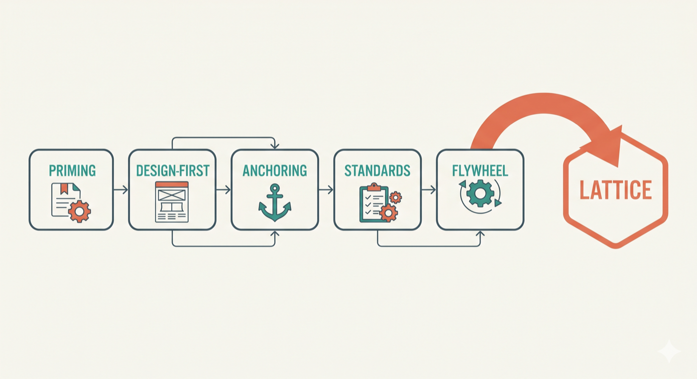
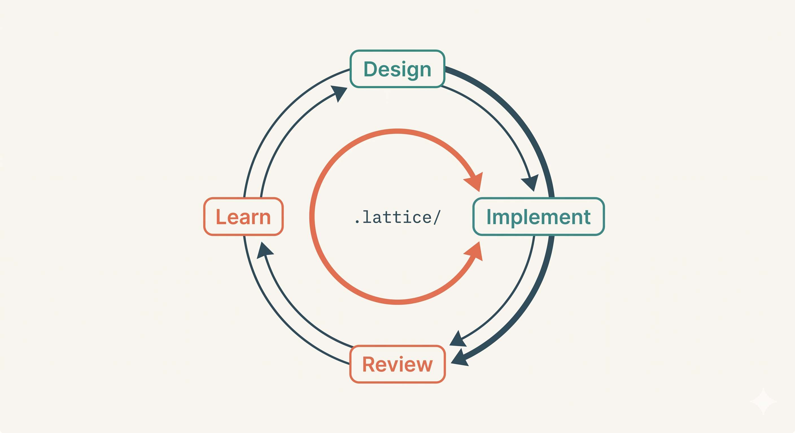
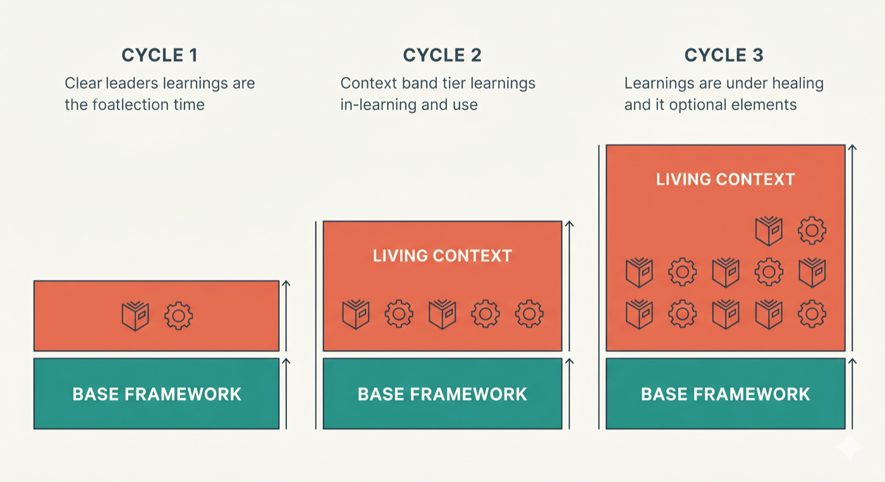

# From Patterns to Framework — The Origin of Lattice

*Why five collaboration patterns became an installable framework, and the design philosophy behind the decisions.*

---

Most collaboration patterns do not fail the first time someone tries them. They fail a few weeks later. The priming document has not been touched. The design conversation gets skipped because the feature suddenly feels urgent. Review findings are discussed once and then disappear into chat history. The ideas still make sense. What slips is the routine.

That was the thread running through a [five-part series on martinfowler.com](https://martinfowler.com/articles/reduce-friction-ai/):

1. [Knowledge Priming](https://martinfowler.com/articles/reduce-friction-ai/knowledge-priming.html) — onboard the AI like a new hire
2. [Design-First Collaboration](https://martinfowler.com/articles/reduce-friction-ai/design-first-collaboration.html) — whiteboard before keyboard
3. [Context Anchoring](https://martinfowler.com/articles/reduce-friction-ai/context-anchoring.html) — externalize decisions into living documents
4. [Encoding Team Standards](https://martinfowler.com/articles/reduce-friction-ai/encoding-team-standards.html) — make tacit knowledge executable
5. [Feedback Flywheel](https://martinfowler.com/articles/reduce-friction-ai/feedback-flywheel.html) — harvest learnings, improve the system

Lattice is the installable version of those patterns.

---

## The Operationalization Gap

The ideas are not really the problem. Keeping them alive in day-to-day work is.

A team reads the Knowledge Priming article, creates a priming document, and six weeks later the document is stale. Another team tries Design-First for a sprint, then reverts to "just generate the code" when a deadline tightens. A senior engineer crafts careful instructions; her teammates, who did not read the article, still prompt generically.

This is a familiar problem in software engineering. Understanding a practice and consistently applying it are different things entirely. Teams do not rely on developers remembering style rules — they encode them as `.eslintrc`, as CI pipelines, as infrastructure-as-code. The question Lattice keeps returning to: why should AI collaboration patterns be any different?

The gap between "understanding the patterns" and "sustaining them across a team, across projects, across time" is the gap Lattice is designed to close.

---

## Three Design Principles

Three principles guided the framework's design, each tracing to an insight from the series:

**Skills over prompts.** A prompt is personal and ephemeral — it lives on one developer's machine and disappears when the session ends. A skill is shared and versioned — it lives in the repository, evolves through pull requests, and applies consistently for everyone.

**Composability over monoliths.** Small, single-purpose skills that combine into workflows beat a monolithic instruction document that tries to cover everything at once. When something needs to change, the team changes one atom, and every molecule that composes it benefits.

**Living context over static config.** The framework gets smarter with use. Review findings feed back into generation. Standards grow more precise as refiners are re-run. The `.lattice/` folder is not configuration that gets set once and forgotten — it is institutional memory that accumulates with every feature cycle.

---

## From Patterns to Skills

Every framework decision in Lattice traces to one of the five articles.

### Knowledge Priming → `knowledge-priming` atom and refiner

The original point: share curated project context before generating code, and treat it as infrastructure rather than habit.

The `knowledge-priming` atom loads a project's identity — tech stack, architecture overview, directory layout, conventions — so all other skills operate with awareness of the real project. The `knowledge-priming-refiner` runs a guided interview that extracts this context and writes it to `.lattice/standards/knowledge-base.md`. Once encoded, every other skill starts from something closer to the actual project instead of the average shape of the internet.

### Design-First → `design-first` atom and `design-blueprint` molecule

The earlier article argued for walking through progressive levels of design before code is written.

The `design-first` atom encodes the five-level methodology: Capabilities, Components, Interactions, Contracts, Implementation. The `design-blueprint` molecule orchestrates a full design workflow — loading context, walking levels sequentially, applying architecture and DDD guardrails at each stage, and persisting the approved blueprint as a living document. Once this lives in a molecule, the discipline stops depending on willpower.

### Context Anchoring → `context-anchoring` atom

Decisions need somewhere durable to live after the session ends.

The `context-anchoring` atom manages per-feature living documents. Every molecule uses it. `design-blueprint` creates the document, `code-forge` enriches it with implementation decisions, `refactor-safely` and `bug-fix` record their own decisions in it. The document survives across sessions, restoring full context when work resumes.

### Encoding Team Standards → code-quality atoms and refiners

The core argument: the senior engineer's instincts should be executable and shared.

Each code-quality atom — `clean-code`, `architecture`, `domain-driven-design`, `secure-coding`, `test-quality` — encodes a specific principle with self-validation checklists and anti-pattern scans. Refiners customize these defaults to each project. The result: team standards apply regardless of who invokes the skill. A prompt on one machine may help one developer; a versioned skill in the repository changes how the whole team works.

### Feedback Flywheel → `review` molecule and `.lattice/learnings/`

The final pattern: turn AI sessions into something a team can learn from rather than discard.

The `review` molecule captures insights and persists them to `.lattice/learnings/review-insights.md`. The generation molecules — `code-forge`, `refactor-safely`, `bug-fix` — load these learnings at the start of every session. If a review found "anemic domain models" in the payment feature, the next `code-forge` session reads that insight and avoids the same pattern. The loop stops depending on retrospectives or memory.

---

## Opinionated by Design, Customizable by Nature

Lattice ships with strong opinions: Clean Architecture, DDD, secure coding, test quality. This is deliberate.

For teams already practicing these disciplines, Lattice amplifies what they already believe. The patterns are not generic "apply best practices" advice — they are encoded as verifiable guardrails the AI applies on every generation and review.

For teams that want to adopt these practices but have not, Lattice lowers the barrier. The AI applies the patterns during actual project work, not in a training exercise. Teams learn by doing, guided by guardrails that prevent the most common mistakes.

These are opinions. Not every team will share them. That is where customization enters.

Every code-quality atom ships with embedded defaults. Refiners let teams customize through a guided interview that produces a standards document in `.lattice/standards/`. Two modes:

**Overlay** (recommended for most teams): customizations layer on top of defaults. Only document what differs — a rule adjusted, a team convention that overrides a generic default. Everything not overridden stays active.

**Override**: the team's document fully replaces the atom's defaults. For teams whose engineering philosophy is fundamentally different from what ships with the framework, this gives complete control.

In both cases, the output is a versioned file in `.lattice/standards/` — PR-reviewable, team-owned, evolved through the same workflow as code. Re-run a refiner whenever standards evolve.

---

## A Feature Lifecycle, End to End

A SaaS product adding notification preferences: invoices by email, product activity in-app, SMS for urgent alerts, marketing messages kept separate from mandatory system notifications. The kind of feature where teams usually discover whether their AI workflow is disciplined or improvised.

**Initialize.** `lattice-init` scans the codebase, identifies existing configuration, and suggests refiners in priority order. The team captures project identity, architecture conventions, and review expectations in `.lattice/`. This happens once per project but shapes every feature that follows.

**Design.** `design-blueprint` loads project context and walks through five progressive design levels. The team decides where preference rules belong, whether notification settings live inside an existing user aggregate or deserve their own boundary, how channel-specific rules flow through contracts and validation. The approved blueprint is persisted as a living document. No code is written yet.

**Implement.** `code-forge` loads the blueprint plus prior review learnings. It generates the domain model, application flow, persistence changes, and tests inside the project's architectural boundaries. Each component is verified against atom checklists after generation. The living document is enriched with implementation decisions.

**Review.** `review` performs an independent assessment. Perhaps it notices that marketing preferences and mandatory notifications have been collapsed into the same model, or that an infrastructure concern is leaking into the domain layer. Findings are severity-ordered. Insights are captured in `.lattice/learnings/review-insights.md`.

**Next feature.** When the same product later adds quiet hours or channel-level escalation rules, `code-forge` loads the earlier insights and avoids the same mistakes. The system is smarter than it was one feature ago.

The whole series is running as a pipeline. Initialize = Knowledge Priming. Design = Design-First. The living document across stages = Context Anchoring. Atom checklists during generation and review = Encoding Team Standards. Insights feeding the next cycle = Feedback Flywheel.

---

## The Compounding Effect

The framework does not just apply the patterns once and leave them alone. It changes as the team keeps using it.

After a few feature cycles, atoms are not applying generic rules — they are applying the team's rules, informed by the team's review history. `code-forge` does not repeat mistakes that `review` already caught, because the learnings loop is persistent and automatic. Standards grow more precise as refiners are re-run with accumulated experience.

Collaborative judgment self-diminishes. As the project's standards grow more specific through refiners and context documents, fewer things remain genuinely ambiguous. The atom that teaches the AI to ask questions gradually makes itself less necessary. If a question keeps recurring across features, that is a signal to run a refiner and encode the answer as a standard. Once encoded, the atom has a clear answer and does not need to ask.

What stays constant: the base framework — atoms, molecules, refiners — never changes between feature cycles. What grows: the living context layer. Standards become more precise. Learnings capture more patterns. Context documents accumulate the project's decision history.

This is where the Feedback Flywheel stops being a nice idea and becomes part of the working routine — a persistent read/write loop between generation and review that runs every time the pipeline is used.

---

## Extensions Beyond the Series

Building the framework surfaced one idea the series had not named explicitly: **collaborative judgment**. AI coding assistants face genuine ambiguity constantly — a borderline single-responsibility call, a debatable layer placement, an arguable aggregate boundary. Without guidance, the AI resolves these silently and presents one path as if no trade-off existed. The `collaborative-judgment` atom teaches the AI to recognize genuine uncertainty and surface it as structured options instead of guessing. See [Collaborative Judgment](collaborative-judgment.md) for the full design rationale.

Building Lattice also clarified three supporting lessons: generation and verification work better as separate passes; markdown skills need compliance-oriented phrasing to be followed consistently; and the atom/molecule/refiner split emerged from the practical need to separate principles, workflows, and customization. See [Framework Intelligence](framework-intelligence.md) for the mechanics behind these.

The atom and molecule set is not closed. As the community provides feedback, new molecules can be composed from existing atoms, and new atoms can encode additional principles. The refiner mechanism means new opinions can arrive as defaults that teams reshape — not mandates they must accept.
