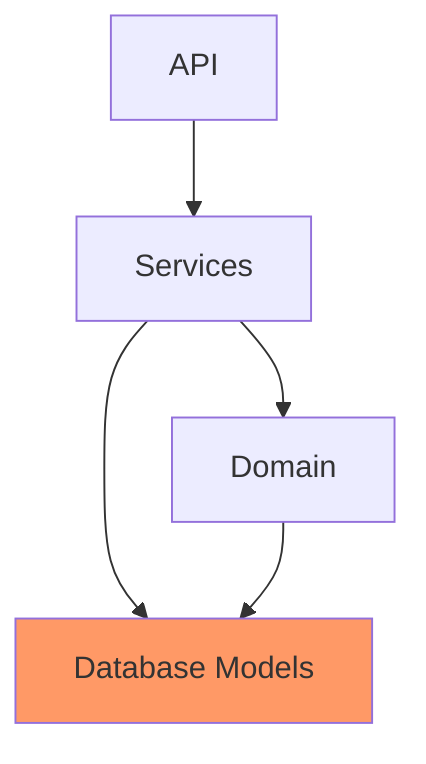
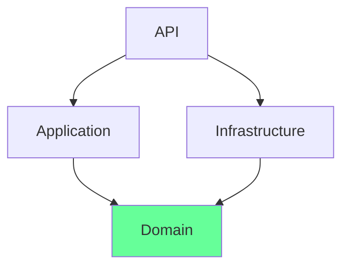

# Plan Transformation

## Required Skills

Read, apply:

1. `framework:knowledge-priming` -- Load codebase context: language, framework, structure, conventions (always)
2. `framework:architecture` -- Architectural audit lens and target architecture guardrails (always)
3. `framework:domain-driven-design` -- Strategic DDD only: bounded contexts, domain seams, core vs supporting subdomains (conditional: only when domain complexity warrants it)
4. `framework:collaborative-judgment` -- Surface judgment calls with structured options during co-design rounds (always)
5. `framework:context-anchoring` -- Write and maintain `.lattice/transform/plan.md` as a living document (always)

## Workflow

### Step 1: Load Existing Context

**Check for an existing plan first.** If `.lattice/transform/plan.md` already exists:
- Read it. Determine its status: is a current-state map present? Is a target architecture agreed? How many slices are complete?
- Resume from the earliest incomplete step. Do not restart the scan if the current state is already agreed.
- Tell the user what was found and where the session will continue from.

If no existing plan: proceed from Step 2.

Check for `.lattice/config.yaml`. If present, load it — read `knowledge-base.md` and `architecture.md` from `.lattice/standards/` if they exist. These shape the audit lens and the to-be proposal.

If no `.lattice/` config exists, offer to run `lattice-init` first (recommended — the architecture standards refiner produces context that makes the to-be proposal significantly sharper). If the user declines, proceed with defaults inferred from the codebase scan.

Use `framework:knowledge-priming` to establish codebase identity before any analysis.

---

### Step 2: Silent Scan — Architectural Signal Extraction

Do not ask any questions yet. Read the codebase and form a hypothesis first.

A large codebase cannot be read exhaustively. This is signal extraction, not a full read. Execute in order; stop reading a module once its responsibility, dependencies, and layer fit are clear.

**Scanning protocol (10 steps, ~15–25 targeted reads total):**

1. **Directory tree** (3 levels deep) — reveals intended organization, whether layers exist as explicit directories, naming conventions across the entire codebase. Do this before opening any file.

2. **Dependency manifests** — `package.json`, `pom.xml`, `go.mod`, `requirements.txt`. Language, framework, key external dependencies.

3. **Architecture documents** — `README.md`, `ARCHITECTURE.md`, `docs/`, ADR directories. The intended architecture often lives here. The gap between intention and reality is itself a finding.

4. **Archaeology** — before analysing flows, reduce scope:
   - Dead code (no callers) — note as candidates for deletion, but do not call them safe to delete without verifying no side effects: static initializers, scheduled tasks, event listeners, and framework-registered hooks are invisible to call-graph analysis and can be "dead" by call count but live by execution
   - Duplicate functionality (two implementations of the same concept — must reconcile before transforming)
   - Implicit coupling (shared mutable state, globals, ambient context, thread-locals)
   - Hidden integration points (outbound calls to external systems in unexpected places)

5. **Seam identification and viability** — look for natural boundaries where one side can change without the other knowing:
   - Domain seams (distinct business concepts)
   - Technical seams (I/O boundary vs. business logic, persistence vs. domain)
   - Team seams (code owned by distinct groups)
   - Temporal seams (code pre/post a significant design decision, visible in naming changes)
   For each seam found, assess viability: how many callers cross it? How much scaffolding does exploiting it require? A seam with 2 callers is a very different cut from one with 40. Rank seams by exploitation cost — cheap seams should become early slices.
   Seams are the cuts the transformation will exploit. Finding viable seams IS the transformation plan.

6. **Import and dependency patterns** — grep import statements across all source files. Do not open full bodies yet. Reveals dependency direction, load-bearing modules, and layer violations cheaply.

7. **Entry points** — 3–5 files: routes, controllers, CLI handlers, event consumers. Reveals the outermost layer.

8. **Interface and contract files** — interfaces, abstract classes, ports. Reveals intended architectural boundaries, whether or not they are consistently followed.

9. **One representative file per top-level module** — confirm responsibility and catch what the import grep missed.

10. **Stop. Form the hypothesis:**
    - What the current architecture actually is vs. what it was intended to be
    - **Drift or mismatch?** Architectural drift = sound intention, gradual decay → restore and reinforce. Architectural mismatch = wrong pattern for the domain from the start → replace, not restore. Carry this answer into Step 5 — the to-be proposal approach is different for each case.
    - Which seams are viable (low exploitation cost) vs. costly
    - Most significant structural violations, with specific named evidence
    - Dead code and duplicate candidates (side-effect-safe deletion candidates only)

    If a module's responsibility, dependencies, and layer fit remain unclear after Step 9, read one additional representative file from that module before stopping. This is the only permitted extension of the scan.

**Skip entirely:** full method implementations, test files, generated code, vendor directories, migration files, static assets. Never open a file when the import grep already answered the question.

---

### Step 3: Targeted Interview

**In practice: 5–7 questions.** Skip any the scan already answered — do not ask what can be inferred. The header "8–10" is the ceiling, not the target. A sharp 5-question interview is better than a thorough 10-question form.

Present only the relevant questions grouped by type:

**Context (what the scan cannot tell):**
- What is the core domain of this application?
- Who are the primary consumers — end users, other services, or both?
- What parts of the codebase cause the most pain day-to-day?
- Are any modules intentionally off-limits for this transformation?
- Must the system remain fully deployable throughout migration, or can it be in a transitional state?
- Has the team attempted a transformation before? What stopped it? *(Previous failures reveal specific blockers that will recur unless the plan accounts for them.)*
- Which areas does the team understand well vs. poorly? *(Low-understanding zones are high-risk — flag them explicitly in the plan.)*
- Are there implicit contracts with external systems not visible in the code? *(Undocumented integrations will break during execution if not identified now.)*

**Intent (what the team wants):**
- How strict should layer boundaries be — pragmatic layering or strict hexagonal?
- What is the appetite for DDD — strategic only (bounded contexts) or also tactical patterns?
- Is there a preferred architecture style, or should the AI recommend based on the codebase?

**Clarification (only for genuine scan ambiguities):**
Only ask if the scan produced something that cannot be interpreted without team context. Examples:
- "I see `services/` mixing business logic and DB calls — is this drift or intentional?"
- "Two modules share domain concepts — one bounded context or two?"

---

### Step 4: Current State Agreement (Round 1)

Present the architectural snapshot from the scan. The goal is a shared, accurate map — not a critique.

Present:
- Drift or mismatch determination — with rationale
- Current layer structure (or absence), with specific directory/file evidence
- Module inventory: what each module actually owns and what it shouldn't
- Dependency flow — prose with Mermaid diagram showing layers and violations



- Seams identified — which boundaries already exist and which are missing
- Dead code and duplicates found — quick wins before transformation begins
- Key violations — specific and named, not generic

After presenting the snapshot, ask specifically: *"Does this map accurately reflect how the codebase is structured today? What's missing, wrong, or intentional that I've marked as a violation?"* Update the map based on feedback. Repeat until the user explicitly confirms the map is accurate.

**Do NOT advance to Step 5 until the user explicitly confirms the current state map is correct.** This gate is non-negotiable — a target architecture designed against an inaccurate current state produces a gap analysis full of phantom problems.

Use `framework:collaborative-judgment` to surface any genuine ambiguity that cannot be resolved by the scan alone.

---

### Step 5: Target Architecture Proposal (Round 2)

Propose a target architecture tailored to *this* codebase — not a generic template. Name specific layers, specific module moves, specific dependency rules derived from what was actually found.

**Carry the drift/mismatch determination forward:**
- If **drift**: the original architectural intent was sound. Identify what that intent was (from architecture docs, naming patterns, or team interview) and propose restoring it — not reinventing it. The target should feel like "what this was always trying to be."
- If **mismatch**: the original pattern was wrong for this domain. Design fresh from the domain up. Do not try to fix the existing structure — replace it.

**Minimum viable target principle:** Propose the simplest structure that resolves the stated pain. The test: is each slice an improvement in itself, or does the target only pay off at the very end? A target that requires six months before anything is better is the wrong target. Resist the pull toward the theoretically perfect architecture.

Apply `framework:architecture` guardrails to validate the proposal. The non-negotiable rule to enforce: **domain must have zero dependency on infrastructure — infrastructure depends on domain**. Every other dependency rule follows from this inversion. Flag any proposed structure that violates it.

Apply `framework:domain-driven-design` (strategic level only) when: the codebase has multiple distinct business capabilities, different parts change at different rates, different teams own different areas, or different data ownership boundaries exist. If none of these apply, skip DDD — a layered architecture without explicit bounded contexts is the right target.

The proposal covers:
- Architecture style and rationale — why this style suits this specific codebase
- Layer definitions — what each layer owns, what it must never own
- Dependency direction rules — explicit allowed and forbidden flows, with the domain/infrastructure inversion stated as a hard rule
- Module and folder structure — use layer names that match the language and framework conventions of this codebase, not a Java/Spring template. A Go project names things differently from a Spring Boot project.
- Bounded context boundaries (if applicable)
- Target architecture Mermaid diagram



- Target repository structure — annotated folder tree showing the new shape

```
src/
├── api/                  ← HTTP handlers, request/response models
├── application/          ← use cases, orchestration
├── domain/               ← core business logic, interfaces (ports)
└── infrastructure/       ← DB, external services, adapters
```

Annotate key representative files per layer. Do not list every file.

**The plan is a hypothesis, not a specification.** State this explicitly in the proposal: the target architecture is the best current understanding and will be refined as execution reveals new information.

After presenting the proposal, ask specifically: *"Does this target architecture reflect what you want to reach? Are there constraints, preferences, or non-negotiables that should change this proposal?"* Refine until the target is agreed and written down. This is the north star for all subsequent slices.

**Do NOT advance to Step 6 until the user explicitly confirms the target architecture.** Every execution decision — strategy, sequencing, slice scope — derives from this agreement. Proceeding without it produces a plan with no stable foundation.

This step is also a valid stopping point. If the team only needs current + target architecture agreed, the session can end here with a partial plan document. The gap analysis and slice backlog can be built in a follow-up session by resuming from Step 6.

---

### Step 6: Gap Analysis and Execution Strategy

With both states agreed, derive the path.

**Gap analysis — structural items only:**
- Must change — structural moves required to reach the target (layer introductions, module splits, dependency inversions)
- Should change — structural violations worth fixing while doing the transformation
- Explicitly defer — named things outside this transformation's scope, consciously deferred not forgotten
- Leave alone — parts already aligned — do not disturb them

Do not include tactical items (anemic models, poor naming, missing tests) in the gap analysis. These are execution concerns handled by `code-forge` and `refactor-safely` when slices run. Including them dilutes the plan and makes prioritisation impossible.

**Transformation strategy** — choose one approach and justify it using the selection criteria below:

- **Strangler fig** — use when: the system must remain fully deployable throughout; risk tolerance is low; old and new can operate in parallel without significant overhead. The new architecture grows alongside the old; responsibility migrates gradually; old code is deleted only when fully replaced.
- **Layer-by-layer** — use when: the codebase is small to medium; domain seams are weak or unclear; establishing clean layers is the primary goal before bounded contexts can be drawn.
- **Bounded-context-by-bounded-context** — use when: domain complexity is the primary driver; seams are clear and viable; different bounded contexts have low coupling. Fully transform one context before touching another.
- **Hybrid** — use when: you need early structural visibility (skeleton) before committing to a slice order. Establish the architecture skeleton first (empty layers, interfaces), then fill in bounded context by context.

State: sequencing constraints (what must happen before what), which tracks can run in parallel, where temporary adapters are needed and when they must be removed. Adapters that are not given an explicit removal condition become permanent — name the removal trigger for each one.

Present the strategy. Use `framework:collaborative-judgment` to resolve the approach if there are genuine tradeoffs between options. Ask specifically: *"Does this migration approach and sequencing match your team's capacity and risk tolerance?"*

**Do NOT advance to Step 7 until the user explicitly confirms the execution strategy.** The slice backlog is derived from the strategy — building slices against an unagreed strategy produces a backlog the team will not follow.

---

### Step 7: Build Slice Backlog

Derive slices from the gap analysis and agreed strategy. Every slice must map to a specific structural delta. No slice exists without a reason.

Each slice:
```
**[Slice Name]**
- Scope: which module(s), layer(s), or bounded context
- Structural change: what moves, what gets created, what gets deleted
- Pre-conditions: which slices must complete first
- What still works after this slice: explicit statement of which system
  capabilities remain intact. Example: "All existing API endpoints respond
  correctly; payment processing continues to function; user authentication
  is unaffected." If this cannot be answered, the slice is too large — split it.
- Risk: Low / Medium / High — with rationale
- Success criteria: structural (e.g., "Domain layer has no imports from Infrastructure")
```

Order slices: (1) unblocks others first, (2) highest severity, (3) lowest blast radius.

Flag any slice where execution would change a public API or external contract — these require explicit user sign-off before execution begins.

Present the full slice backlog to the user. Ask: *"Does this backlog accurately represent the transformation work? Are any slices missing, too large, or incorrectly sequenced?"* Refine until agreed.

**Do NOT advance to Step 8 until the user confirms the slice backlog.** The plan document is the written record of this agreement — writing it before agreement produces a document nobody trusts.

---

### Step 8: Write the Plan Document

Produce `.lattice/transform/plan.md` using `framework:context-anchoring`.

**Required structure:**

```markdown
# Transformation Plan — [Project Name]

## Codebase Identity
Language, framework, size, team context, delivery constraints.

## Archaeology Findings
Dead code identified. Duplicates to reconcile. Implicit coupling. 
Hidden integration points. Quick wins before transformation begins.

## Domain Map
Core domain. Bounded contexts and seams. Core / supporting / generic subdomains.

## Current Architecture
Drift or mismatch determination with rationale.
Layer structure and module inventory.
[Mermaid diagram — layers and violations]
Key violations — specific and named.

## Target Architecture
Architecture style and rationale.
Layer definitions and dependency rules.
[Mermaid diagram — clean target]
[Annotated target repository structure tree]
[Bounded context map — if applicable]

## Gap Analysis
Must change / Should change / Explicitly deferred / Leave alone.

## Transformation Strategy
Approach chosen and rationale.
Sequencing constraints. Parallel vs. sequential tracks.
Adapter/bridge strategy and removal criteria.

## Slice Backlog
- [ ] Slice 1 — scope, structural change, pre-conditions, what still works, risk, success criteria
- [ ] Slice 2 — ...

## Progress Log
Updated as slices complete. Date, what changed, decisions made, new findings.
```

The document must be complete enough that a new AI session — or a new team member — can read it alone and know exactly what was decided, what has been done, and what to do next. No re-briefing required.

State explicitly in the document: *"This target architecture is the best current understanding. It will be refined as execution reveals new information."*
